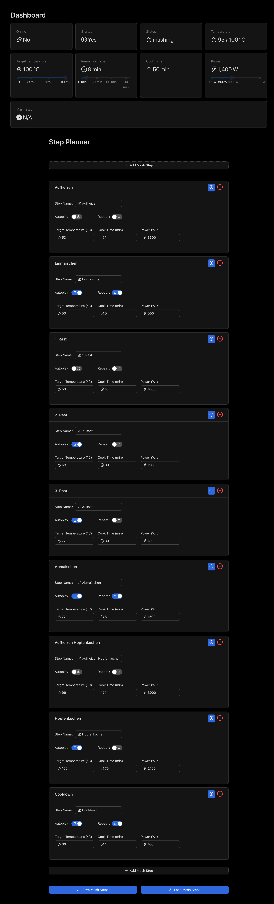

# Brewmaster for Klarstein Brauheld Smart

Welcome to the Brewmaster app for Klarstein Brauheld Smart! This Docker image is designed for hobby brewers who want a seamless and enjoyable brewing experience. Our user-friendly application, crafted with React and Go, lets you effortlessly manage your brewing sessions. Here’s how to get started!

## Introduction

Our app connects directly with the Klarstein Brauheld system via the Tuya IoT platform, allowing for programmable control of your brewing process. With just a few setups, you can begin brewing like a pro!

## Prerequisites

Before diving in, ensure you have Docker installed on your computer. If you haven’t installed it yet, you can download it from [Docker's official site](https://docs.docker.com/get-docker/).

## Setup Guide

### Pairing the Klarstein Brauheld with Tuya

1. **Install the Tuya App:** Download and install the Tuya app on your smartphone (not the Klarstein app).
2. **Create a Tuya Account:** Sign up for a new account within the app.
3. **Activate Pairing Mode:** On your Klarstein Brauheld, hold the reset button for 5 seconds to enter pairing mode.
4. **Add Device:** In the Tuya app, select "Add Device" -> "Others" -> "Others (Wi-Fi)".
5. **Retrieve Credentials:**
   - **Access ID and Key:** Go to the [Tuya IoT Development Platform](https://iot.tuya.com/) and log in or create a developer account if needed. Create a "Smart Home" cloud project and enable APIs such as "IoT Core." Then, find your **Access ID** and **Access Key** in the project’s "Authorization Key" section under "Overview".
   - **Device ID:** Retrieve your Tuya Device ID through the Tuya App by going to your device settings, selecting "Device Information," and noting the displayed Device ID.

## Running the Application

To launch the app, execute the following command in your terminal.
Be sure to replace `<your tuya access id>`, `<your tuya access key>`, and `<your tuya device id>` with your actual Tuya credentials.

```bash
docker run -p 8080:8080 -e TUYA_ACCESS_ID="<your tuya access id>" -e TUYA_ACCESS_KEY="<your tuya access key>" -e TUYA_DEVICE_ID="<your tuya device id>" icereed/brewmaster
```

This command will start the Brewmaster application and make it accessible at port 8080 on your host machine.

## Accessing the Application

After starting the Docker container:

- **Open a Web Browser:** Navigate to [http://localhost:8080](http://localhost:8080).
- **Begin Brewing:** Explore the application and start your brewing adventure!

## Enjoy Brewing!

Questions? Join the discussions and get tips on the [original forum thread](https://hobbybrauer.de/forum/viewtopic.php?p=519277).

Happy brewing!

## Bonus: Screenshot


